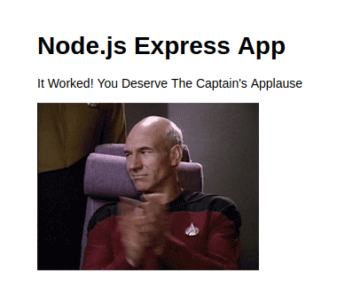

# docker_testbed
This repository serves as a "playground" to expose my learning using Docker to "containerize" applications. It is based on one of the **BretFisher**'s repository (https://github.com/BretFisher/udemy-docker-mastery), which contains most of the resources I've been using so far in his course.

### node_js
**node_js** is a folder containing the source code of a simple web application which should print the following image:

To make this work with Docker, we encapsulate this application into an image built on the **DockerFile** constructor. To execute the webserver in a container, follow the steps:

The `run` command look up for a cached version of the image and download it, in case necessary. The `-p 80:3000` open the PORT 80 at the host-side (e.g., local machine) and open the PORT 3000 at the node_js container. Finally, the `--rm` parameter allows to autoamatically remove the container instantiation after its execution. 
1. `docker container run -p 80:3000 --rm arielgoes/my-first-image`

